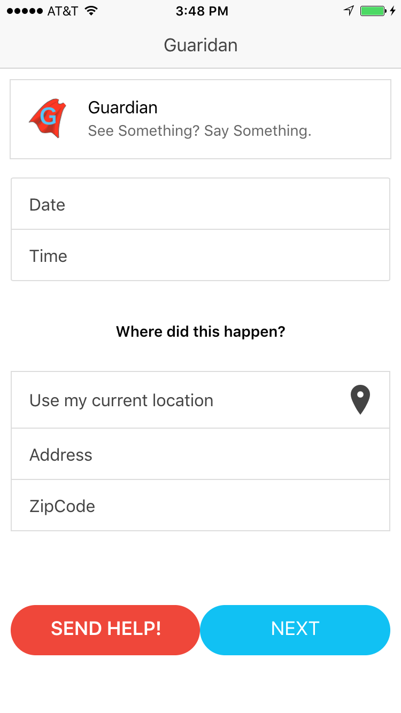
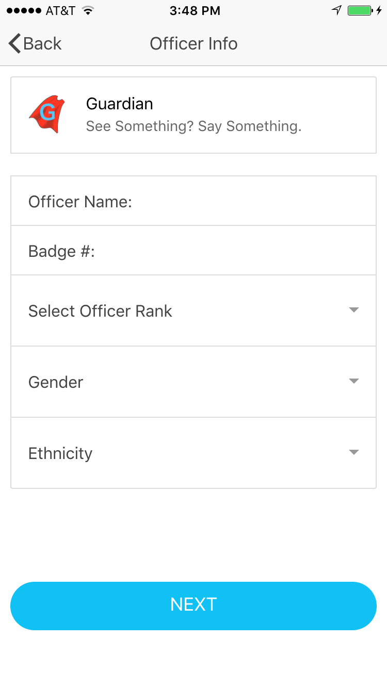
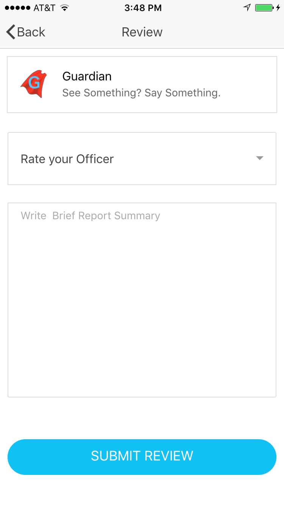

  <h1></img>  Guardian </h1>

    Guardian is an app that seeks to provide individuals within the law enforcement industry as well as general public 
    an opportunity to voice their opinions and experiences with law enforcement.

    During the Women Who Code Atlanta Hackathon, we (@PublicDefenders twitter handle) were not able to complete all that we set out to do.
    I have taken the final project to enhance our idea.

    Taking the web application a step further by converting it over to an phone app using the ionic framework and adding 
    a backend using MongoDB, NodeJS.

    # Future Enhancements

    On the userside I would like to add a map that talks to a crime api to show and inform the uses of what's going on 
    in their community. Awareness is key and information is knowledge.

    Complete the "Boss" side code. The "Boss" code is a glimpse into what the "higher ups" can view when reviewing 
    officers within their precinct.
      - I have tried to find an API of Police Officers but have come up short, if anyone can help I would be very thankful. 

  
  
  <h1></img>Home Page </h1>
  <h1></img>Enter officer Info Page </h1>
  <h1></img>Review Page </h1>
  

    Team: Public Defenders :
    Ayanna Kosoko, Elle Chun, Jassimran Somal, Lynsey Ham, Nikaylah Woody, Ronique Young and Shanda Kennedy created this app as part of Women Who Code Hackathon Atlanta
